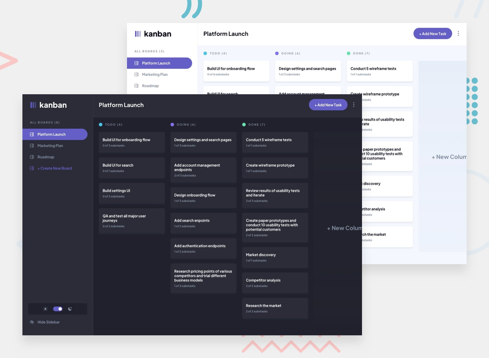

# Frontend Mentor - Kanban task management web app

## Welcome! 👋

Project is in progress. It almost works. Need some CSS fixes, logic fixes. Most important to do:

- Editing task and board
- When we change task status, it dissapears form column but not showing in new one, need to refresh
- Drag and drop
- Form validation
- Some small bugs

I decided to not make light mode.

### Here u can watch current status of app:

https://github.com/CptCartoon/Kanban-FullstackApp-Angular-JavaSpring/assets/80262312/01efaa2d-d6e1-4316-8a58-b467283f7f5d

### Expected Behaviour

  - Boards
  - [x] Clicking different boards in the sidebar will change to the selected board. DONE ✓
  - [x] Clicking "Create New Board" in the sidebar opens the "Add New Board" modal. DONE ✓
  - [x] Clicking in the dropdown menu "Edit Board" opens up the "Edit Board" modal where details can be changed. DONE ✓
  - [ ] Columns are added and removed for the Add/Edit Board modals. ADDING DONE ✓ | REMOVE TO DO
  - [x] Deleting a board deletes all columns and tasks and requires confirmation. DONE ✓
- Columns
  - [x] A board needs at least one column before tasks can be added. If no columns exist, the "Add New Task" button in the header is disabled. DONE ✓ | BUTTON DISABLED TO DO
  - [x] Clicking "Add New Column" opens the "Edit Board" modal where columns are added. DONE IN DIFFERENT WAY ✓
- Tasks
  - [x] Adding a new task adds it to the bottom of the relevant column. DONE ✓
  - [ ] Updating a task's status will move the task to the relevant column. If you're taking on the drag-and-drop bonus, dragging a task to a different column will also update the status. DONE ✓ but it doesn't show task in different colum - to do | drag and drop to do

### Used technologies
- Angular 17
- Java Spring
- MySQl
