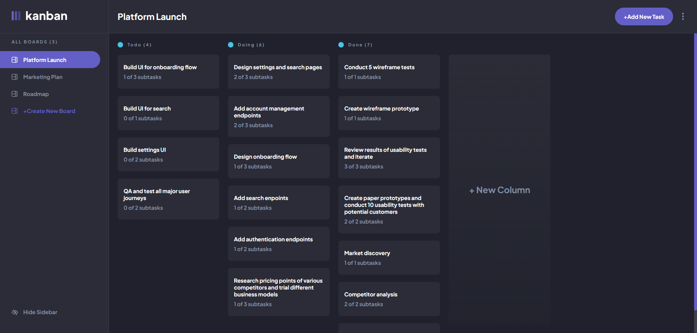

# Frontend Mentor - Kanban task management web app solution

This is a solution to the [Kanban task management web app challenge on Frontend Mentor](https://www.frontendmentor.io/challenges/kanban-task-management-web-app-wgQLt-HlbB). Frontend Mentor challenges help you improve your coding skills by building realistic projects.

## WARNING

Frontend was refactored to work with new Backend built in ASP.NET Core 8. [You can chek it here](https://github.com/CptCartoon/Kanban-FullstackApp-Backend-ASP.NET-Core-API). Java Spring Backend in this repository is deprecated and need to be refactored.

### Links

- Live Site URL: [Live Server Preview](https://kanban-fe-gfedc9esa3dgb9h4.polandcentral-01.azurewebsites.net/)

## Overview

This time I didn't focus on RWD and some other things like light/dark mode. The goal was to improve fullstack skills.

### The challenge

Users should be able to:

- See hover states for all interactive elements on the page
- Create, read, update, and delete boards and tasks
- Receive form validations when trying to create/edit boards and tasks
- Mark subtasks as complete and move tasks between columns
- Hide/show the board sidebar
- **Bonus**: Allow users to drag and drop tasks to change their status and re-order them in a column
- **Bonus**: Keep track of any changes, even after refreshing the browser (`localStorage` could be used for this if you're not building out a full-stack app)
- **Bonus**: Build this project as a full-stack application

### Screenshot

### Built with

- HTML
- CSS
- Angular 17
- ASP.NET Core 8 (New API)
